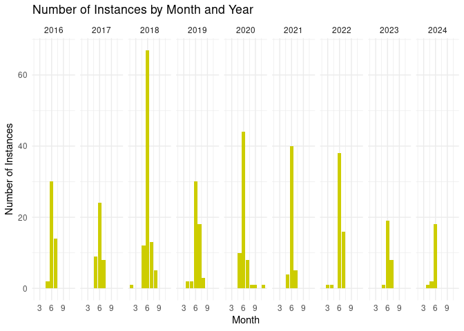

Firefly Abundance
================
Lizzy Kocherhans
2025-10-30

- [ABSTRACT](#abstract)
- [BACKGROUND](#background)
- [STUDY QUESTION and HYPOTHESIS](#study-question-and-hypothesis)
  - [Questions](#questions)
  - [Hypothesis](#hypothesis)
  - [Prediction](#prediction)
- [MOTHODS](#mothods)
  - [Fill in 1st analysis
    e.g. barplots](#fill-in-1st-analysis-eg-barplots)
  - [Fill in 2nd analysis/plot e.g. generalized linear
    model](#fill-in-2nd-analysisplot-eg-generalized-linear-model)
- [DISCUSSION](#discussion)
  - [Interpretation of 1st analysis
    (e.g. barplots)](#interpretation-of-1st-analysis-eg-barplots)
  - [Interpretation of 2nd analysis (e.g. generalized linear
    model)](#interpretation-of-2nd-analysis-eg-generalized-linear-model)
  - [Optional interpretation of 3rd analysis
    (e.g. heatmaps)](#optional-interpretation-of-3rd-analysis-eg-heatmaps)
- [CONCLUSION](#conclusion)
- [REFERENCES](#references)

# ABSTRACT

# BACKGROUND

# STUDY QUESTION and HYPOTHESIS

## Questions

Does firefly abundance cahnge monthly in the past 8 years (2016-2024)?

## Hypothesis

Fierily abundance will increase in earlier months of the year when
compared with past years.

## Prediction

We will see an increase in fireflies at earlier points in the year.

# MOTHODS

several line plots for the 8 years and a scatter plot (or linear
regression) to compare peak abundance from the past 8 years.

## Fill in 1st analysis e.g. barplots

``` r
data <-read.csv("UtahFireflies - Revised.csv")


ggplot(data, aes(x= Month))+
  geom_bar(fill = "yellow3") +
  facet_grid(~ Year) +
  labs(title = "Number of Instances by Month and Year", 
       x = "Month", 
       y = "Number of Instances") +
  theme_minimal()
```

<!-- -->

## Fill in 2nd analysis/plot e.g. generalized linear model

linear regression

# DISCUSSION

Fill in here… For each analysis, summarize what you found and interpret
the results. Say whether they support or contradict your hypothesis.

## Interpretation of 1st analysis (e.g. barplots)

The first analysis… fill in here what it was, the summary of the
results, and your interpretation.

## Interpretation of 2nd analysis (e.g. generalized linear model)

The second analysis… fill in here what it was, the summary of the
results, and your interpretation.

## Optional interpretation of 3rd analysis (e.g. heatmaps)

The third analysis… fill in here what it was, the summary of the
results, and your interpretation.

# CONCLUSION

Fill in here… State the overall answer to your research question, based
on all analyses. Mention whether the evidence supports your hypothesis
and what it suggests about WNV amplification in Salt Lake City.

# REFERENCES

Fill in here… List all sources you cited in your background and
throughout the report. Use a consistent style.a conclusion you can draw
from your analysis.

1.  Komar N, Langevin S, Hinten S, Nemeth N, Edwards E, Hettler D, Davis
    B, Bowen R, Bunning M. Experimental infection of North American
    birds with the New York 1999 strain of West Nile virus. Emerg Infect
    Dis. 2003 Mar;9(3):311-22. <https://doi.org/10.3201/eid0903.020628>

2.  ChatGPT. OpenAI, version Jan 2025. Used as a reference for functions
    such as plot() and to correct syntax errors. Accessed 2025-10-30.
